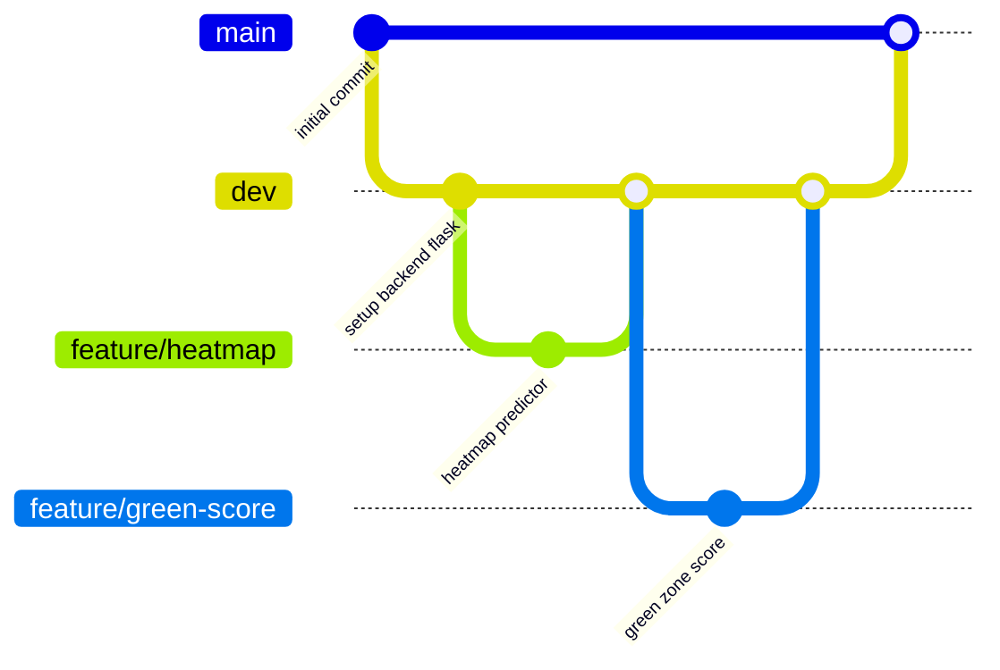

## Git Branching Strategy

To ensure smooth collaboration, clean integration, and stable releases, we adopt the following Git branching strategy:

**1. `main` branch**
- This branch always contains the **stable, deployable version** of the project.  
- It is used for **weekly MVP demonstrations**, presentations, and final deployment.  
- Only merge into `main` via **merge requests (MRs)** that have been **reviewed and approved**.

**2. `develop` branch**
- This is the **integration branch** for all features under active development.  
- It may contain small bugs but must remain generally **runnable**.  
- All feature branches should be merged into `develop` via **merge requests**.

**3. `feature/*` branches**
- Each feature or module (e.g., `feature/heatmap`, `feature/route-planner`) should be developed in a separate branch.  
- These are created from `develop`, and merged back into `develop` once completed and reviewed.

**4. `hotfix/*` branches**
- For urgent fixes (e.g., a crash in production), create a `hotfix/bug-name` branch from `main`.  
- After resolving the issue, merge the fix into both `main` and `develop`.

### summary
- `main`: Stable and deployable version. No direct push allowed.
- `develop`: Integration branch. Feature branches should merge here.
- `feature/*`: For each new feature, create a separate branch from `develop`.
- `hotfix/*`: For urgent fixes, create a `hotfix/bug-name` branch from `main`. 

## Workflow
0. Clone the Repo
Once added to the project:
```
git clone https://csgitlab.ucd.ie/ZhaofangHe/comp47360_team9.git
```

1. Pull the latest `develop`:
   ```
   git checkout develop
   git pull origin develop
   ```

2. Create a new feature branch:
   ```
   git checkout -b feature/your-feature-name
   ```

3. Make your changes and commit:
   ```
   git add .
   git commit -m "feat: your message"
   ```

4. Push and open a merge request:
   ```
   git push origin feature/your-feature-name
   ```

### Summary
- Clone the repo and always pull the latest `develop` branch.    
- Create a new branch from `develop` before starting a task.    
- Commit regularly with meaningful messages.    
- Open a **merge request (MR)** to merge back into `develop` (or into `main`, if it’s a hotfix).    
- All MRs must be **reviewed by at least one team member** before merging.


## Git Branching Strategy graph:




